# 💊 MediLens AR

> Marker-based Augmented Reality (AR) mobile application for displaying medication information and medication reminders using Unity, Vuforia, and Firebase.

---

## 📖 About the Project

MediLens AR is a Final Year Project (FYP) developed to help users access medicine information interactively through Augmented Reality (AR). Users can scan medicine markers to visualize 3D medicine models, read medication details, and manage medication reminders within a single mobile application.

The application also includes a pharmacist module that allows medicine records and AR markers to be managed through a dedicated dashboard.

---

## ✨ Features

### 👤 User Module
- User Registration & Login
- Forgot Password
- Marker-based AR Medicine Scanner
- 3D Medicine Visualization
- Medication Information
- Medication Reminder
- Reminder History
- Scan History
- User Profile

### 👨‍⚕️ Pharmacist Module
- Dashboard Overview
- Medicine Record Management
- Edit Medicine Information
- AR Marker Library

---

## 🛠 Technologies Used

| Category | Technology |
|----------|------------|
| Game Engine | Unity |
| AR SDK | Vuforia Engine |
| Programming Language | C# |
| Backend | Firebase Authentication |
| Database | Cloud Firestore |
| IDE | Visual Studio |
| Version Control | Git & GitHub |

---

# 📱 Application Screenshots

## Login
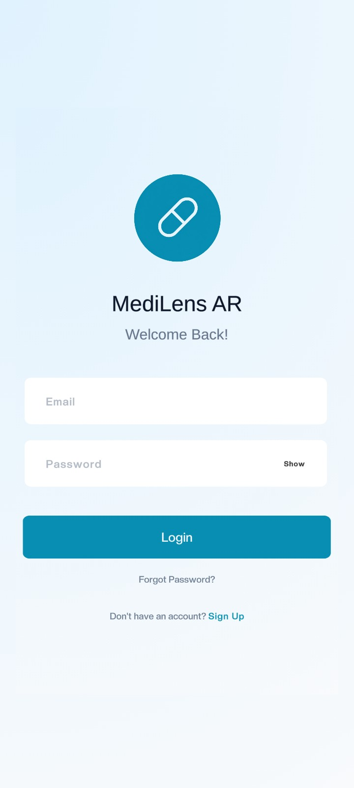

---

## Sign Up
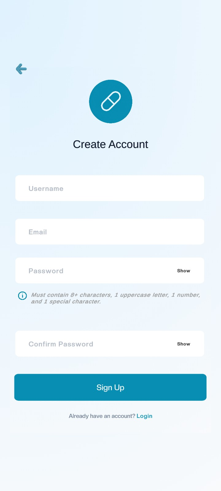

---

## Home
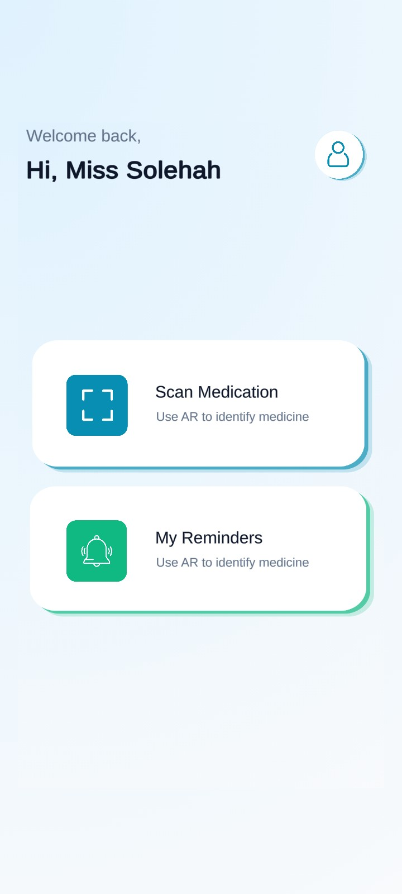

---

## AR Scanner
### Before Scanning Marker
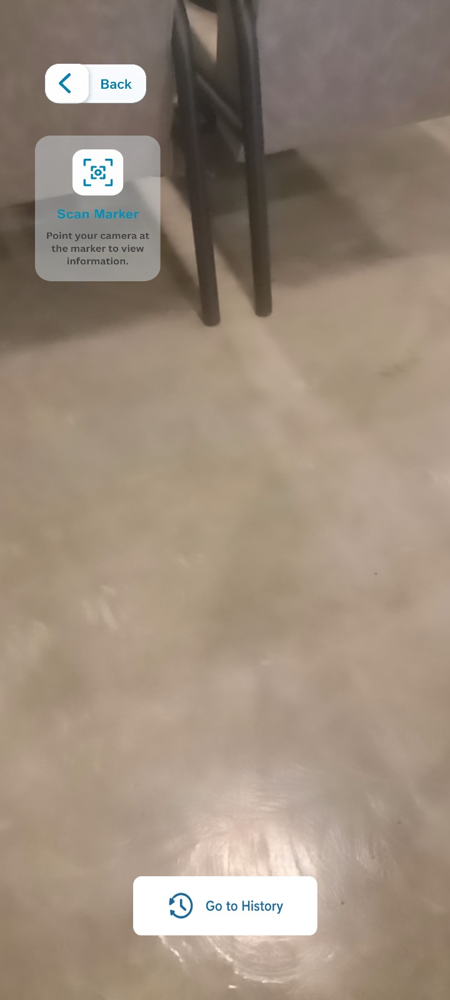

### After Scanning Marker
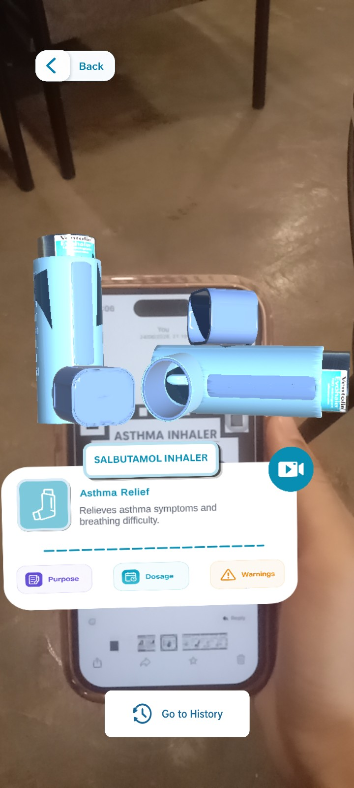

---

## Medication Reminder
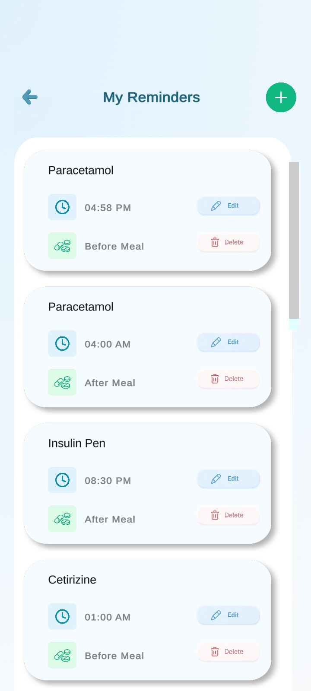

---

## Add Reminder
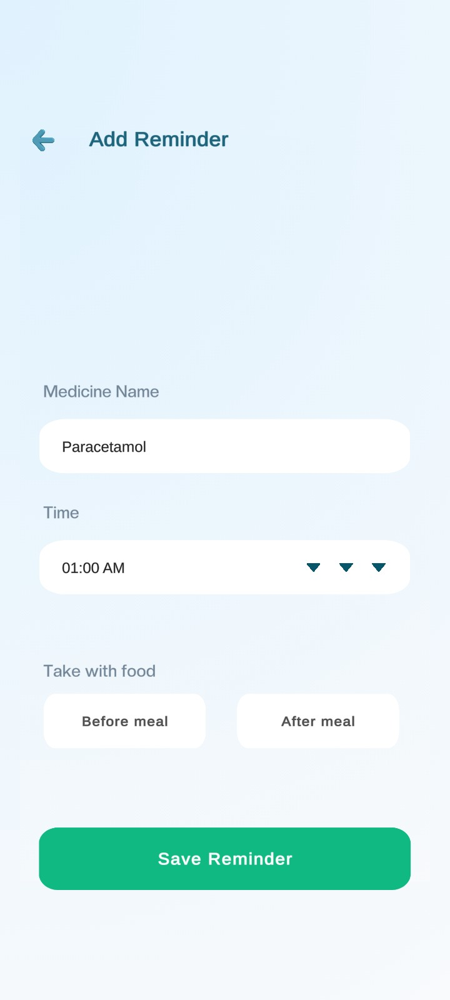

---

## Scan History
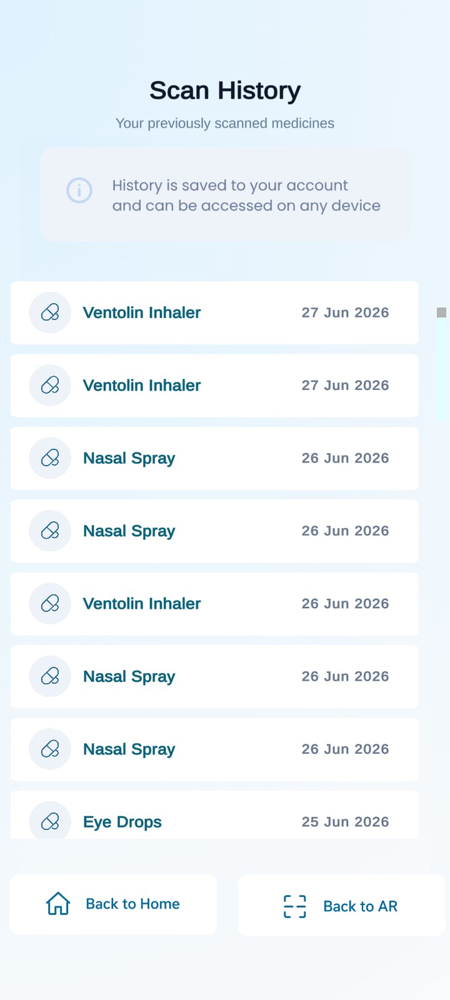

---

## User Profile
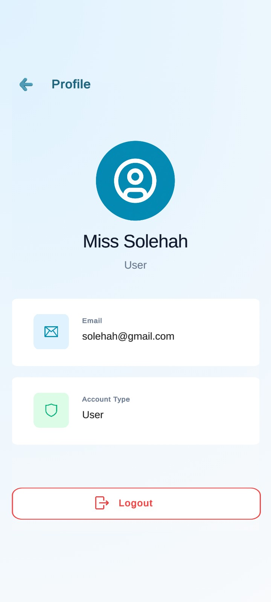

---

## Forgot Password
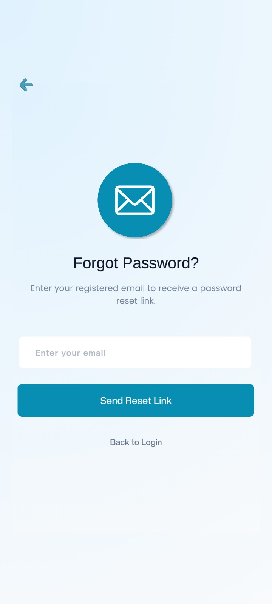

---

# 👨‍⚕️ Pharmacist Module

## Dashboard
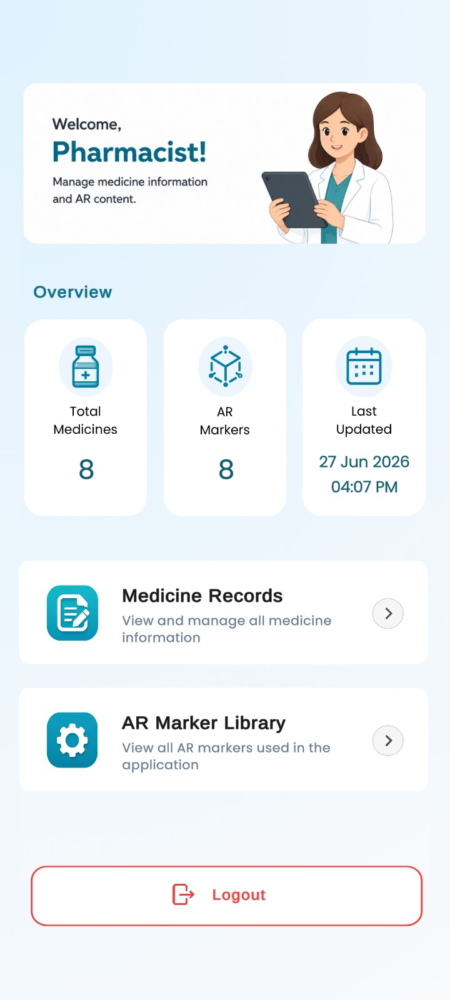

---

## Medicine Records
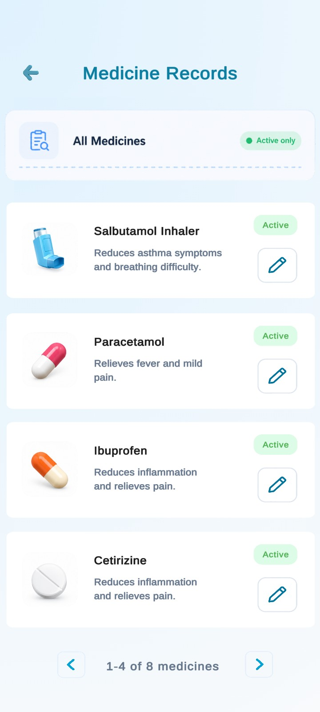

---

## Edit Medicine
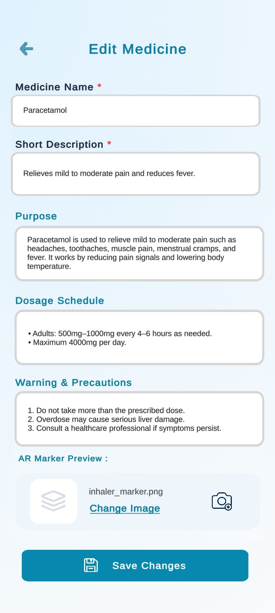

---

## AR Marker Library
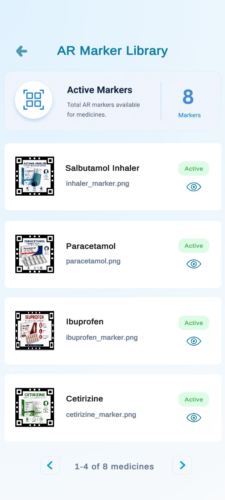

---

## 🚀 Future Improvements

- AI-powered medicine recognition
- OCR-based medicine label detection
- Voice assistant for medication guidance
- Multi-language support
- Cloud synchronization across devices
- Medicine interaction checker

---

## 👩‍💻 Developer

**Siti Sofeah**

Bachelor of Software Engineering (Hons.)  
Universiti Kebangsaan Malaysia (UKM)

Final Year Project (2026)
